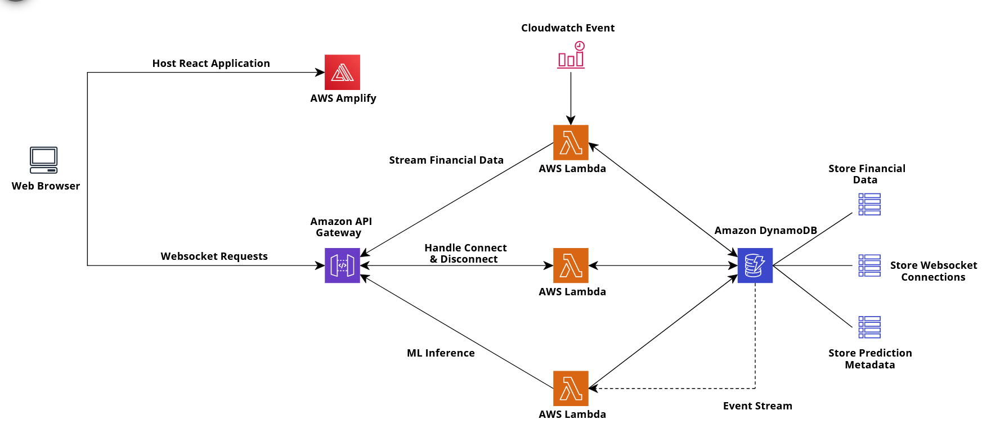

# Forex Technical Analysis Platform
A platform providing foreign exchange rates, global market news, & forecasting tools

# AWS Deployment Instructions
Login to the public AWS Elastic Container Registry with
```
aws ecr-public get-login-password --region us-east-1 | docker login --username AWS --password-stdin public.ecr.aws
```

cd into the directory containing lambda functions with
```
cd lambda
```

Start docker locally and run
```
sam build
```

To deploy the lambda functions run
```
sam deploy -g
```

# Platform Architecture
<p align="center">
  
</p>
