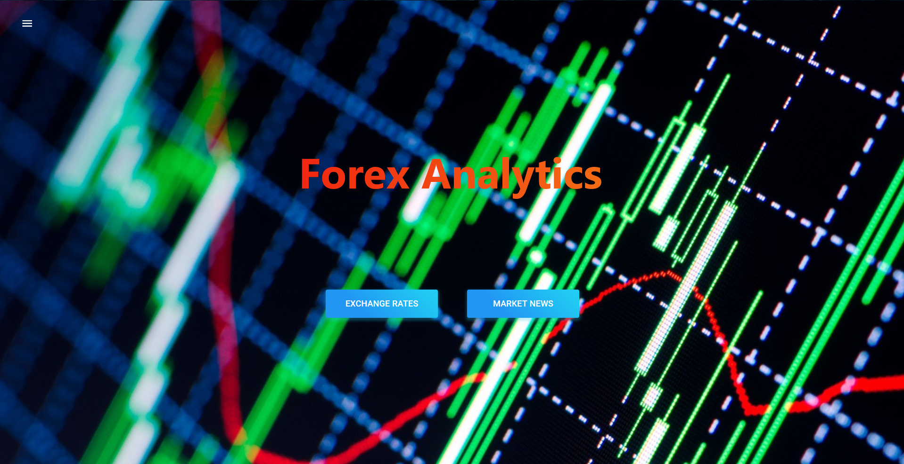
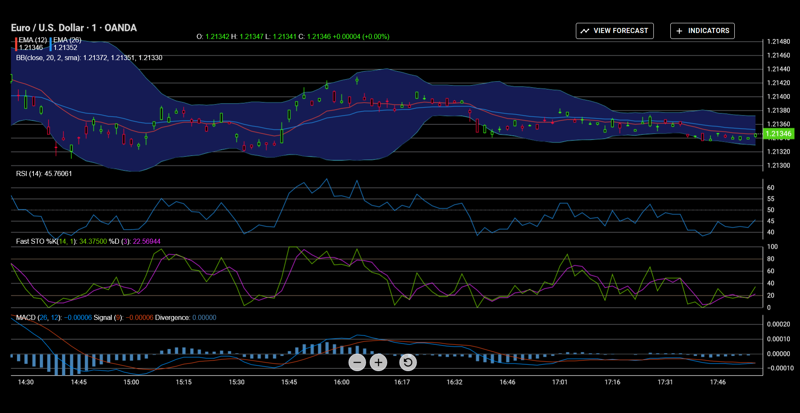
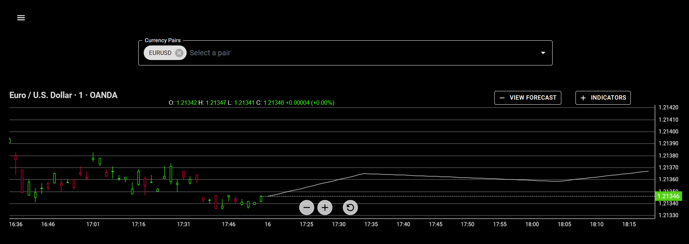
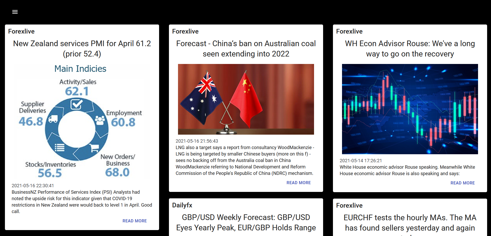

# Forex Analytics Platform
A platform providing foreign exchange rates, global market news & forecasting tools in real-time

  

<h2>Exchange Rates</h2>

  

<h2>LSTM Generated Forecasts</h2>

  

<h2>Global Market News</h2>

  

# Platform Architecture

  

# Future Features
- Develop backtrading system
- Add economic calendar
- Setup user authentication
- Add support for more currency pairs
- Use Elasticsearch to filter news
